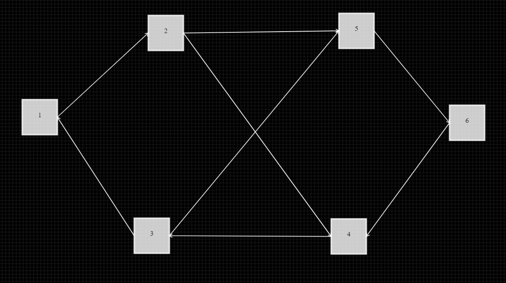

# Graph Editor

A simple editor where you can create nodes and connect to each other and write text inside them

[Live Website](https://martinogarrizzo5.github.io/graph-editor/)

## Commands

Left Click => Create node / Move node

Shift + Left Click => Mark for connection (green color)

Ctrl + X => Delete Node

Double Left Click => Select node (yellow color)

Right click => Scroll through the editor

## Preview

